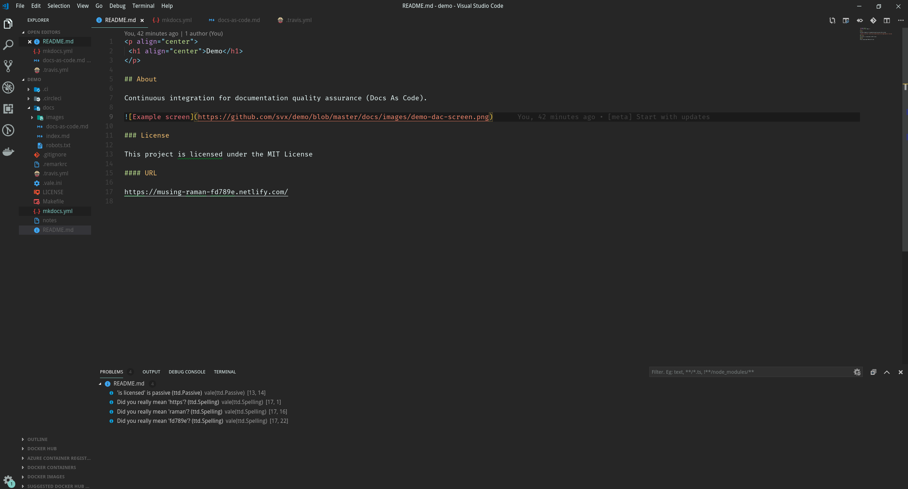

# Write Drunk - Test Automated

Documentation Quality Assurance

---

## About

Demo of Continuous Integration Testing for documentation (Docs As Code).

## Requirements

- [Visual Studio Code](https://code.visualstudio.com/) or [Atom](https://atom.io/)
- [Vale](https://errata-ai.github.io/vale/) and Vale add-on for [VS-Code](https://github.com/lunaryorn/vscode-vale) or [Atom](https://atom.io/packages/atomic-vale)

